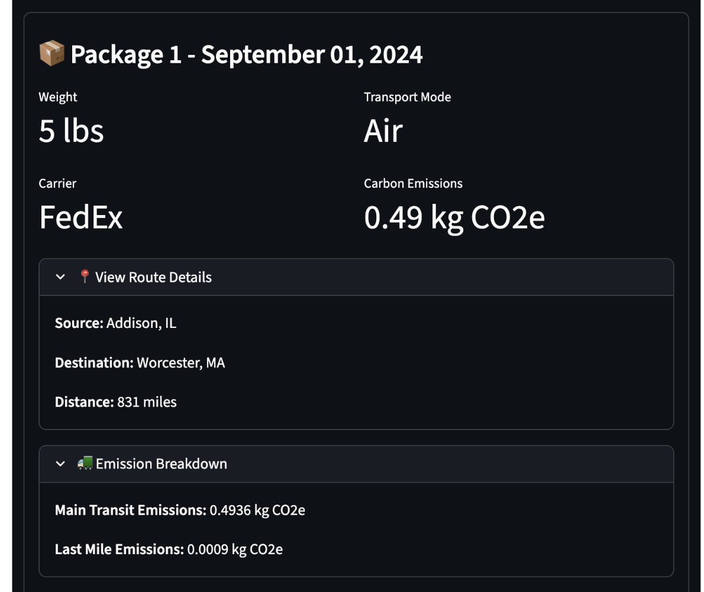

# Surbhi Kapoor

## Overview
I am a Data Scientist currently pursuing my Masters in Data Science with 6+ years of industry experience. I specialize in building NLP and ML systems end to end, including data preparation, model design, deployment, monitoring, and communicating results to product and business teams.

I am currently enjoying being in an academic environment where I get to research and experiment deeply. I enjoy tackling problems creatively and building solutions that are both effective and efficient.

---

## Featured Work

<h3>Quaxar Fraud Detection Platform</h3>

Designed and deployed an end-to-end fraud detection platform using LayoutLMv3, SentenceTransformers, XGBoost, and OpenAI API integrations. Built containerized FastAPI services, deployed on AWS, and owned architecture decisions and product demos.

<a href="https://github.com/surbhikapoor19/quaxar_fraud_platform" target="_blank">View Summary</a>

<h3>Ottimate Invoice Intelligence</h3>

Fine tuned transformer models for document processing and entity extraction across millions of invoice records. Built text classification and normalization pipelines and led EDA and BI reporting for finance, operations, and product stakeholders.

<a href="#work-experience">Details Below</a>

---

## Research Projects

### Mental Health Risk Prediction (NHIS)

<a href="https://github.com/surbhikapoor19/nhis_mental_health_survey" target="_blank">Project Repository</a>

**Goal:** Predict psychological distress risk using demographic and behavioral survey data.  
**Dataset:** 32,629 adult participants, 630 variables (CDC NHIS dataset)

**Approach**
- Parsed coded variables into interpretable features
- Conducted exploratory data analysis to identify risk patterns
- Trained Random Forest models for binary and multi-class severity prediction

**Results**
- Achieved 85–90 percent accuracy
- Identified interpretable risk factors that enable early screening

**Impact:** Demonstrates that early mental health screening can be done using accessible data sources.

---

### Assessing Underserved Transit Regions (NYC)

<a href="https://github.com/We-Gold/ds-501-cs4-public" target="_blank">Project Repository</a>

Identified underserved regions by calculating accessibility gaps and modeled predicted ridership and revenue to support investment decisions.

---

### WPI Greenboard: Carbon Emissions Intelligence

<a href="https://github.com/We-Gold/wpi-greenboard" target="_blank">Project Repository</a>

Built a carbon emissions tracking system with multi-carrier API integration and optimized batch geocoding and throughput performance.

---

### Statistical ML on Supermarket Data

<a href="https://github.com/surbhikapoor19/ds502-project" target="_blank">Project Repository</a>

EDA and business decisions based on statistical analysis on supermarket sales data. We eventually trained models to predict profit margin across products and analyzed feature importance.

## Work Experience {#work-experience}

### Quaxar — Data Scientist / ML Product Lead  
*May 2025 – Aug 2025*  
- Built and deployed a fraud detection platform using LayoutLMv3, SentenceTransformers, and XGBoost ensembles  
- Integrated OpenAI APIs for OCR assistance, document integrity scoring, and fraud reasoning  
- Developed FastAPI services, Docker containers, and AWS deployments  
- Owned architecture, experimentation, demos, and communication with stakeholders  

### Ottimate (formerly Plate IQ) — Senior Data Scientist  
*Aug 2018 – Apr 2024*  
- Fine tuned transformer models for invoice-level document processing  
- Built NLP classification pipelines using BERT, spaCy, scikit-learn, pandas, and NumPy  
- Performed EDA and developed BI dashboards for product and operations teams  
- Worked across modeling, data workflows, and business intelligence in a startup setting  

---

## Other Standalone Projects

### [Receipts OCR Segmentation](https://github.com/surbhikapoor19/receipts_ocr_segmentation)  

---

## Skills & Tools

**Languages:** Python, SQL  
**ML & NLP:** Hugging Face Transformers, BERT, LayoutLMv3, SentenceTransformers, XGBoost, Random Forest  
**Generative AI & Agents:** OpenAI APIs, Prompt Design, Agentic Workflows, RAG  
**Data Analysis:** pandas, NumPy, EDA, Feature Engineering  
**Deployment:** FastAPI, Docker, AWS, PostgreSQL + pgvector  
**Visualization & BI:** Plotly, Power BI, SQL Dashboards  
**Collaboration:** Git, Stakeholder Communication, Cross-functional workflows

---

## Contact
**Email:** surbhi.kapoor19@gmail.com  

**LinkedIn:** [https://www.linkedin.com/in/surbhikapoor19](https://www.linkedin.com/in/surbhikapoor19)

**GitHub:** [https://github.com/surbhikapoor19](https://github.com/surbhikapoor19)
