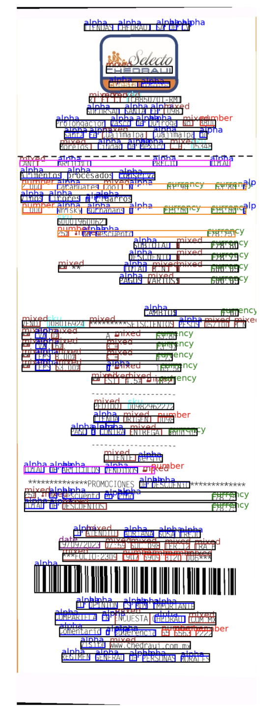
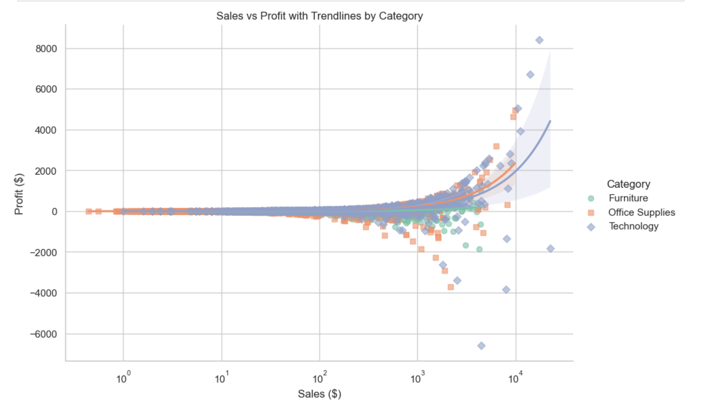
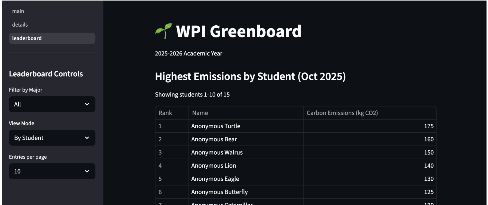
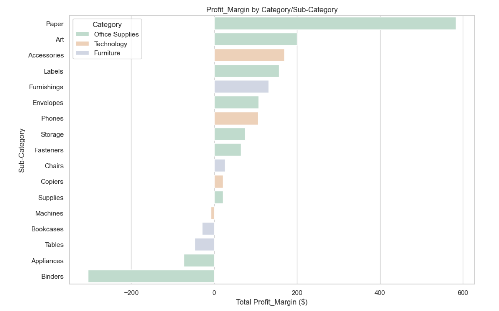
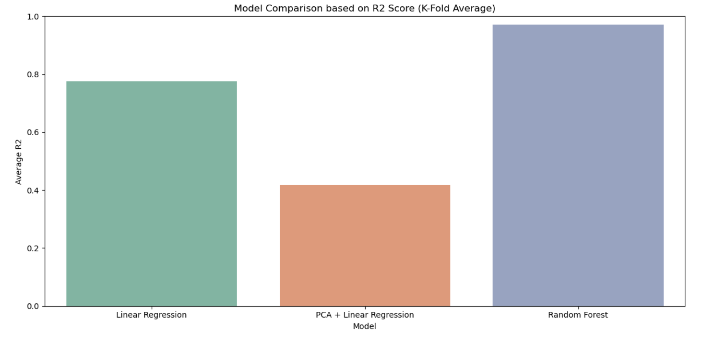

<a href="https://www.linkedin.com/in/surbhikapoor19" target="_blank">LinkedIn</a> · 
<a href="https://github.com/surbhikapoor19" target="_blank">GitHub</a> · 
<a href="mailto:surbhi.kapoor19@gmail.com">Email</a>

## About Me

I'm a Data Scientist pursuing my **MS in Data Science at WPI (4.0 GPA)** with 6+ years of industry experience. I build end-to-end NLP and ML systems—from model design to production deployment.

Currently focused on **Document AI**, **Healthcare ML**, and **Agentic Workflows**.

---

## Education

<h3>🎓 Worcester Polytechnic Institute</h3>

<strong>M.S. Data Science</strong> · GPA: 4.0

Jan 2025 – May 2026

<h3>🎓 University of Illinois Urbana-Champaign</h3>

<strong>B.S. Applied Mathematics</strong>

2014 – 2018

---

## Projects

Click any project to learn more

+

Healthcare ML
<h3>Mental Health Risk Prediction</h3>

Predicting psychological distress using CDC survey data

+

Geospatial
<h3>NYC Underserved Transit Regions</h3>

Accessibility gap analysis and ridership modeling

+

Sustainability
<h3>Carbon Emissions Intelligence</h3>

Multi-carrier API tracking system for WPI

+

Document AI
<h3>Receipts OCR Segmentation</h3>

OCR + LLM text extraction with Streamlit

+

Statistical ML
<h3>Supermarket Profit Analysis</h3>

EDA and profit margin prediction models

<!-- Expandable Project Details -->

<h3>Mental Health Risk Prediction (NHIS)</h3>
<button class="close-btn" onclick="toggleProject('mental-health')">×</button>

<strong>Goal:</strong> Predict psychological distress risk using demographic and behavioral survey data.

<strong>Dataset:</strong> 32,629 adult participants, 630 variables (CDC NHIS)

<h4>Approach</h4>
<ul>
<li>Parsed coded variables into interpretable features</li>
<li>Conducted EDA to identify risk patterns</li>
<li>Trained Random Forest models for binary and multi-class severity prediction</li>
</ul>
<h4>Results</h4>
<ul>
<li>Achieved <strong>85–90% accuracy</strong></li>
<li>Identified interpretable risk factors for early screening</li>
</ul>
<a href="https://github.com/surbhikapoor19/mental_health_distress_predictor" target="_blank" class="project-link">View Repository →</a>

<h3>Assessing Underserved Transit Regions (NYC)</h3>
<button class="close-btn" onclick="toggleProject('nyc-transit')">×</button>

Identified underserved regions by calculating accessibility gaps and modeled predicted ridership and revenue to support investment decisions.

<h4>Key Contributions</h4>
<ul>
<li>Geospatial analysis of transit accessibility</li>
<li>Ridership prediction modeling</li>
<li>Revenue impact assessment for investment planning</li>
</ul>
<a href="https://github.com/We-Gold/ds-501-cs4-public" target="_blank" class="project-link">View Repository →</a>

<h3>WPI Greenboard: Carbon Emissions Intelligence</h3>
<button class="close-btn" onclick="toggleProject('greenboard')">×</button>

Built a carbon emissions tracking system with multi-carrier API integration and optimized batch geocoding and throughput performance.

<h4>Features</h4>
<ul>
<li>Multi-carrier shipping API integration</li>
<li>Batch geocoding optimization</li>
<li>Real-time emissions tracking dashboard</li>
<li>Leaderboard for sustainability metrics</li>
</ul>
<a href="https://github.com/We-Gold/wpi-greenboard" target="_blank" class="project-link">View Repository →</a>

<h3>Receipts OCR Segmentation</h3>
<button class="close-btn" onclick="toggleProject('ocr')">×</button>

A customizable template for extracting text via OCR + LLMs with layout information and label tags.

<h4>Features</h4>
<ul>
<li>Streamlit prototype for uploading test receipts</li>
<li>Keyword enhancement for classifications</li>
<li>Visualization utils for training data context</li>
<li>Comprehensive test suite</li>
<li>Modular, easy-to-configure codebase</li>
</ul>
<a href="https://github.com/surbhikapoor19/receipts_ocr_segmentation" target="_blank" class="project-link">View Repository →</a>

<h3>Statistical ML on Supermarket Data</h3>
<button class="close-btn" onclick="toggleProject('supermarket')">×</button>

EDA and business decisions based on statistical analysis on supermarket sales data. Trained models to predict profit margin across products and analyzed feature importance.

<h4>Approach</h4>
<ul>
<li>Exploratory data analysis on sales patterns</li>
<li>Statistical hypothesis testing</li>
<li>Profit margin prediction models</li>
<li>Feature importance analysis</li>
</ul>
<a href="https://github.com/surbhikapoor19/ds502-project" target="_blank" class="project-link">View Repository →</a>

---

## Work Experience

<h3>Medlaunch Concepts</h3>
Machine Learning Engineer Intern
Jan 2026 – May 2026

<ul>
<li>Built <strong>end-to-end ML pipelines</strong> using CMS healthcare quality measures data</li>
<li>Designed <strong>ETL pipelines in AWS</strong> (S3, Glue, Athena) for large-scale datasets</li>
<li>Developed feasibility models combining <strong>statistical ML and LLM-powered</strong> insights</li>
<li>Utilized <strong>SageMaker</strong> for model prototyping and deployment planning</li>
</ul>

<h3>Quaxar</h3>
ML Product Lead | Data Scientist
May 2025 – Dec 2025

<ul>
<li>Led development of <strong>AI-powered document intelligence platform</strong></li>
<li>Fine-tuned <strong>Microsoft Florence</strong> for document object detection</li>
<li>Built platform processing <strong>120K+ documents/month</strong> with <strong>99.9% uptime</strong></li>
<li>Integrated <strong>OpenAI APIs</strong> for OCR validation and agentic workflows</li>
<li>Created annotation tools labeling <strong>1,000+ documents</strong></li>
</ul>

<h3>Ottimate (Plate IQ)</h3>
Senior Data Scientist
Aug 2018 – Apr 2024

<ul>
<li>Joined as <strong>one of first three data team members</strong>, scaled through Series C</li>
<li>Achieved <strong>97% accuracy</strong> with NLP models, automated <strong>70% of labeling</strong></li>
<li>Reduced duplication from <strong>7% to under 1%</strong> using LSH</li>
<li>Saved <strong>60+ hours/month</strong> by automating 15% of daily uploads</li>
<li>Built <strong>competitive pricing intelligence system</strong> as internal product</li>
</ul>

---

## Certifications

🏆

<h3>NeuralSeek – Agentic AI Workflow Certification</h3>

January – February 2026

Built agentic AI workflows enabling LLM-driven reasoning over enterprise data. Designed multi-step agents with retrieval, search, and tool use capabilities.

---

## Skills

<h4>Languages & Tools</h4>

PythonSQLGitJupyterBash

<h4>Machine Learning</h4>

TransformersBERTLayoutLMv3FlorenceXGBoostDeep Learning

<h4>GenAI & Agents</h4>

OpenAI APIsRAGPrompt DesignNeuralSeekAgentic Workflows

<h4>Cloud & Infrastructure</h4>

AWS S3GlueAthenaSageMakerDockerFastAPI

<h4>Visualization</h4>

PlotlyMatplotlibSeabornPower BI

---

## Contact

<a href="mailto:surbhi.kapoor19@gmail.com" class="contact-btn">📧 surbhi.kapoor19@gmail.com</a>
<a href="https://www.linkedin.com/in/surbhikapoor19" target="_blank" class="contact-btn">💼 LinkedIn</a>
<a href="https://github.com/surbhikapoor19" target="_blank" class="contact-btn">🐙 GitHub</a>

